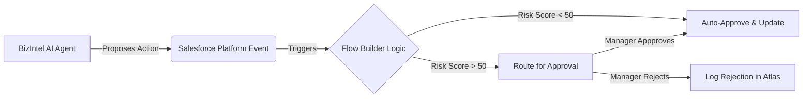

# 🛡️ Flow Builder Governance Layer
## Trust & Safety for Autonomous Agents

This document defines how Salesforce Flow serves as the **Governance Layer** for BizIntel AI, ensuring no AI agent can execute high-risk actions without approval logic.

---

## 🏗️ Architecture: The "Human-in-the-Loop" Switch

BizIntel AI does not write directly to sensitive fields (e.g., changing Opportunity Stage to 'Closed Won'). Instead, it triggers a **Platform Event** or a **Draft Record** that Flow Builder intercepts.

---

## ⚙️ Implementation Guide

### 1. Create the `Agent_Action__e` Platform Event
Define a standardized event for agents to request actions.

**Fields:**
- `Agent_ID__c` (Text, 50) - e.g., "SalesAgent"
- `Action_Type__c` (Text, 50) - e.g., "UpdateStage", "SendEmail"
- `Target_Record_ID__c` (Text, 18)
- `Proposed_Value__c` (Text, 255)
- `Risk_Score__c` (Number, 3, 0) - 0-100 calculated by Agent

### 2. Build the "Agent Action Handler" Flow
**Trigger:** Platform Event (`Agent_Action__e`)

**Logic Steps (Flow Builder):**

#### Step A: Safety Check
- **IF** `Action_Type__c` == "Delete" **THEN** Immediate Hard Stop 🛑
- **IF** `Target_Record_ID__c` IS NULL **THEN** Log Error & Exit

#### Step B: Risk Evaluation
- **Condition:** `Risk_Score__c` > 80 (High Risk)
- **Action:** Create `Approval Request` for Record Owner
- **Outcome:** Wait for response.

#### Step C: Auto-Execution
- **Condition:** `Risk_Score__c` <= 80
- **Action:** Update Record
  - Object: `Opportunity`
  - Id: `Target_Record_ID__c`
  - Field: `StageName` = `Proposed_Value__c`

---

## 🔒 Governance Rules (Admin Overrides)

The following rules are hard-coded into the Flow to prevent AI hallucinations from causing damage:

1.  **The "No-Delete" Rule:** Agents can never delete records.
2.  **The "Price Protection" Rule:** Agents cannot modify `Amount` by more than 10% without Manager Approval.
3.  **The "Spam Guard" Rule:** Max 5 emails per contact per day. Flow counts today's `Task` records; if >5, action is blocked.

---

## 🧪 Testing the Governance Layer

### Scenario: Sales Agent tries to close a deal
1. **Agent Action:** Propose "Closed Won" for $50k deal.
2. **BizIntel Risk Calc:** Closing deals is High Risk (Score: 90).
3. **Flow Trigger:**
   - Detects Score 90 > 80.
   - **BLOCKED:** Does not update Opportunity.
   - **ACTION:** Creates Task "Approve AI Deal Closure" for Manager.
4. **Manager:** Clicks "Approve" on Task.
5. **Flow:** Resumes and updates Opportunity.

---

## 🏆 Judge Talking Points
- "We don't just let AI run wild. We use Salesforce Flow as a deterministic safety net."
- "BizIntel AI provides the intelligence; Flow Builder provides the governance."
- "This architecture ensures compliance and prevents AI accidents."
